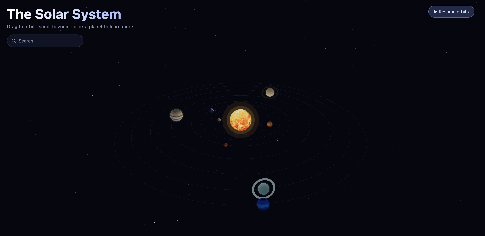

# Solar System 3D

An interactive, explorable 3D model of the solar system built with **React**, **Three.js**, and **React Three Fiber**. Drag to orbit the camera, scroll to zoom, and click any body to fly in and read about it.

  

[Live Site](https://the-3d-solar-system.web.app/)



## Features

- **The Sun, eight planets, and the Moon**, each with real surface textures and rotating on its own tilted axis.
- **Live orbits** — every body travels its own orbital path at a speed scaled (roughly) to its real orbital period, so the inner planets visibly outrun the outer ones.
- **Click to explore** — selecting a body smoothly flies the camera in, frames it, and keeps it centered as it continues to orbit. An info panel slides in with a description and key facts.
- **Type-ahead search** to jump straight to any body by name.
- **Pause / resume** all motion, or freeze automatically while inspecting a selected body.
- **Saturn's textured rings** and **Earth's drifting cloud layer** and **moon**.
- **Moon phases** — the Moon's info panel renders all eight principal lunar phases as SVG diagrams clipped from the real moon texture.
- **Responsive** — on phones and tablets the info panel becomes a draggable bottom sheet and the camera reframes so the selected body stays visible above it.

## Tech stack

| Tool | Role |
| --- | --- |
| [React 19](https://react.dev) | UI and component model |
| [Three.js](https://threejs.org) (r184) | WebGL 3D rendering |
| [@react-three/fiber](https://github.com/pmndrs/react-three-fiber) | React renderer for Three.js |
| [@react-three/drei](https://github.com/pmndrs/drei) | Helpers (`OrbitControls`, `Stars`, `useTexture`, `Html`) |
| [Vite](https://vite.dev) | Dev server and build tooling |
| ESLint | Linting |

## Getting started

Requires [Node.js](https://nodejs.org) (18+ recommended).

```bash
# install dependencies
npm install

# start the dev server (with hot reload)
npm run dev
```


## Controls

| Action | How |
| --- | --- |
| Orbit the camera | Drag |
| Zoom | Scroll / pinch |
| Focus a body | Click it, or pick it from search |
| Deselect / fly back out | Click empty space, or close the info panel |
| Pause / resume orbits | Top-right button |
| Search | Type a name in the top-left box, Enter to select |


## Credits

All textures are from **[Solar System Scope](https://www.solarsystemscope.com/textures/)**, licensed under [CC BY 4.0](https://creativecommons.org/licenses/by/4.0/).

